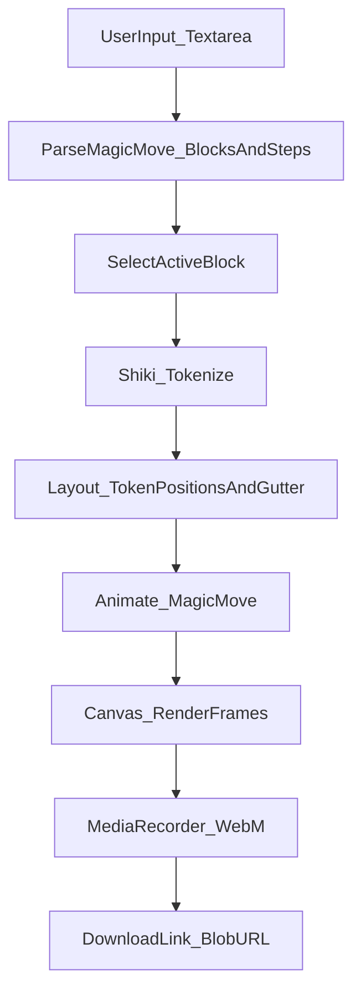

# Magic Move → Video (MVP) — Usage & Internals (Developer Reference)

This app lets you paste **Slidev-style Shiki Magic Move** markdown and export an animated **WebM** video of code morphing between steps.

Reference feature: Slidev “Shiki Magic Move”.

## Dependencies & APIs (what they do, where we use them)

- **Next.js (App Router)** (`next`)
  - **What**: React framework for routing/build/dev server.
  - **Where**: `app/layout.tsx`, `app/page.tsx`, `next.config.ts`, build pipeline.
  - **Why**: simple deploy to Vercel later; zero backend required for this MVP.

- **React** (`react`, `react-dom`)
  - **What**: UI state + rendering.
  - **Where**: `app/page.tsx` (hooks `useState`, `useMemo`, `useEffect`, `useCallback`, refs).
  - **Why**: manage input, timeline playback, export progress, and block selection.

- **Tailwind CSS** (`tailwindcss`, PostCSS)
  - **What**: utility-first styling.
  - **Where**: `app/globals.css`, Tailwind config (via PostCSS), classNames in `app/page.tsx`.

- **Shiki** (`shiki`)
  - **What**: syntax highlighting engine that tokenizes code with theme colors.
  - **Where**: `app/lib/magicMove/shikiHighlighter.ts`.
  - **Why**: we render tokens ourselves onto canvas, so we need token-level colors.

- **Canvas 2D API** (Web API)
  - **What**: immediate-mode drawing API for `<canvas>`.
  - **Where**: `app/lib/magicMove/canvasRenderer.ts`, `app/lib/magicMove/codeLayout.ts`, called from `app/page.tsx`.
  - **Why**: deterministic frame rendering (easy to record to video).

- **MediaStream / `HTMLCanvasElement.captureStream()`** (Web API)
  - **What**: turns a canvas into a video stream at a given FPS.
  - **Where**: `app/lib/video/recordCanvas.ts`.

- **MediaRecorder** (Web API)
  - **What**: encodes a MediaStream into chunks (WebM VP9/VP8).
  - **Where**: `app/lib/video/recordCanvas.ts`.
  - **Quality knobs**: `mimeType` and `videoBitsPerSecond`.

- **Blob + Object URLs** (Web API)
  - **What**: stores the recorded video in-memory and lets the user download it.
  - **Where**: `app/page.tsx` (creates `URL.createObjectURL(blob)` for the download link).

- **Bun** (`bun`)
  - **What**: JS runtime + package manager used by this repo.
  - **Where**: `package.json` scripts (`bun dev`, `bun run build`, etc).

## What you can do

- Paste one or more **magic-move blocks** into the textarea
- Select which block to preview/export (when multiple exist)
- Preview the animation (Play/Pause/Reset)
- Export a **downloadable `.webm`** video
- Use **line numbers** via `{lines:true}` and `{startLine:n}`

## Supported input formats

### Option A: Slidev-style `shiki-magic-move` (recommended)

Use **4 backticks** for the wrapper, and put multiple **triple-backtick** code fences inside.

```md
````shiki-magic-move {lines:true,startLine:5}
```ts
function add(a: number, b: number) {
  return a + b
}
```

```ts
function add(a: number, b: number) {
  const sum = a + b
  return sum
}
```
````
```

- **Outer meta** like `{lines:true,startLine:5}` applies to all steps by default.
- Each inner code fence can override meta, e.g.:
  - ````md
  ```ts {lines:true,startLine:10}
  // ...
  ```
  ````

### Option B: Slidev docs `md magic-move`

```md
````md magic-move
```js
console.log(`Step ${1}`)
```
```js
console.log(`Step ${1 + 1}`)
```
```ts
console.log(`Step ${3}` as string)
```
````
```

### Multiple blocks in one input

You can include multiple magic-move blocks (and any other markdown like slide separators `---`).
The app will show a **Sequence** dropdown so you can choose which block to preview/export.

## Line numbers (Slidev-like)

To enable per-step line numbering:

```md
```ts {lines:true,startLine:5}
// line 5
// line 6
```
```

Or enable for all steps in a block:

```md
````shiki-magic-move {lines:true,startLine:5}
...
````
```

## Preview vs Export behavior (long code blocks)

- **Preview**: The canvas grows vertically to fit the longest step in the selected block, and the preview container is scrollable.
- **Export**: The canvas height is fixed at the start of recording (based on the longest step) so the video includes **all lines** with no clipping.

## How it works (runtime flow)



## File-by-file reference (what each file does)

### UI (app)

#### `app/page.tsx`
- **Role**: The whole MVP UI and orchestrator.
- **Owns state**:
  - `input`: textarea markdown
  - `blockIndex`: which magic-move block is active
  - `theme`: `"dark" | "light"`
  - `fps`, `transitionMs`
  - `forceLineNumbers`
  - `isPlaying`, `playheadMs`
  - `isExporting`, `exportProgress`, `downloadUrl`
- **Key responsibilities**:
  - **Parse** input using `parseMagicMove(input)` and derive `activeBlock`.
  - **Tokenize & layout** each step via `shikiTokenizeToLines()` and `layoutTokenLinesToCanvas()`.
  - **Compute canvas height** using `calculateCanvasHeight()` based on the max line count.
  - **Render** frames via `drawCodeFrame()`; during transitions use `animateLayouts()`.
  - **Playback**: update `playheadMs` on `requestAnimationFrame`.
  - **Export**: set a fixed canvas size, drive rendering for the full timeline, and record via `recordCanvasToWebm()`.

#### `app/layout.tsx`
- **Role**: App Router root layout (HTML shell).
- **Does**: loads global CSS and fonts (Next `next/font`), sets metadata.

#### `app/globals.css`
- **Role**: global styles (Tailwind base + any global tweaks).

### Parsing (magic-move)

#### `app/lib/magicMove/types.ts`
- **Role**: shared types used across parser/render/export.
- **Key types**:
  - `MagicMoveStepMeta`: `{ lines: boolean; startLine: number }`
  - `MagicMoveStep`: `{ lang; code; meta }`
  - `MagicMoveBlock`: `{ kind; outerMeta; steps; errors }`
  - `MagicMoveParseResult`: `{ blocks; errors }`

#### `app/lib/magicMove/parseLineMeta.ts`
- **Role**: parse Slidev-like meta blocks such as `{lines:true,startLine:5}`.
- **Functions**:
  - `parseLineMetaDetailed(info)`: returns `{ meta, specified }` so we can tell whether a value was explicitly set.
  - `parseLineMeta(info)`: returns only `meta` (convenience).
- **Behavior**:
  - Unknown keys are ignored.
  - `lines:true|false` supported.
  - `startLine:n` supported (must be `>= 1`).

#### `app/lib/magicMove/parseMagicMove.ts`
- **Role**: parse the input document into one or more magic-move blocks.
- **What it recognizes**:
  - Outer wrapper: ` ````shiki-magic-move ... ```` ` OR ` ````md magic-move ... ```` ` (4 backticks)
  - Inner steps: triple-backtick code fences inside each wrapper.
- **Important behavior**:
  - Non-code content between inner fences is ignored (Slidev-like).
  - Outer meta is used as defaults; inner meta overrides only when explicitly provided.
  - Returns `blocks[]` so the UI can select which sequence to render/export.

### Highlighting + layout + rendering

#### `app/lib/magicMove/shikiHighlighter.ts`
- **Role**: one-time Shiki initialization + per-step tokenization.
- **Functions**:
  - `shikiTokenizeToLines({code, lang, theme})` → `{ lines, bg }`
- **Themes**: `github-light`, `github-dark`.
- **Languages loaded**: JS/TS/JSX/TSX/JSON/CSS/HTML/Markdown/Bash/Shell/SQL.
- **Fallback**: if tokenization fails (unknown lang), it re-tokenizes as `text`.

#### `app/lib/magicMove/codeLayout.ts`
- **Role**: compute where each token should be drawn on the canvas.
- **Functions**:
  - `makeDefaultLayoutConfig()` returns default sizes (1920×1080 baseline, font, padding).
  - `calculateCanvasHeight({ lineCount, ... })` computes the canvas height to fit all lines (plus one blank line at bottom).
  - `layoutTokenLinesToCanvas({ ctx, tokenLines, ... })` returns `LayoutResult`:
    - positioned tokens
    - gutter width + colors
- **Notes**:
  - Layout assumes a monospace font and uses `ctx.measureText("M")` for character width.

#### `app/lib/magicMove/canvasRenderer.ts`
- **Role**: draw a single frame (background “card”, gutter, tokens).
- **Functions**:
  - `clearAndPaintBackground(...)`
  - `drawCodeFrame({ ctx, config, layout, tokens? ... })`
- **Important detail**:
  - Uses `ctx.canvas.width/height` (not the config) to avoid clipping when the canvas is dynamically resized.

### Animation

#### `app/lib/magicMove/animate.ts`
- **Role**: compute animated token positions between two layouts.
- **Function**:
  - `animateLayouts({ from, to, progress })` → `AnimatedToken[]`
- **Matching strategy** (MVP):
  - Keyed by `(tokenText, occurrenceIndex)` so repeated tokens are matched in order.
  - Unmatched tokens fade out/in.

### Recording / export

#### `app/lib/video/recordCanvas.ts`
- **Role**: record a canvas into a `.webm` Blob.
- **Function**:
  - `recordCanvasToWebm({ canvas, fps, durationMs, onProgress })` → `Blob`
- **Codec strategy**:
  - Prefer `video/webm;codecs=vp9` then `vp8`, then generic `video/webm`.
- **Quality strategy**:
  - Sets `videoBitsPerSecond` (higher than browser defaults) for better text clarity.

## Where “the options” live

- **Video / playback knobs**: `app/page.tsx`
  - `fps`, `transitionMs`, theme selection, force line numbers, export button.
- **Canvas resolution**: `app/lib/magicMove/codeLayout.ts` (`makeDefaultLayoutConfig()` baseline width)
- **Dynamic height**: `app/lib/magicMove/codeLayout.ts` (`calculateCanvasHeight()`)
- **Bitrate / codec**: `app/lib/video/recordCanvas.ts`
- **Supported languages**: `app/lib/magicMove/shikiHighlighter.ts`

## Notes / limitations (current MVP)

- Export format is **WebM** (MP4 would require ffmpeg, typically server-side).
- “Magic move” matching is a pragmatic heuristic (good for many refactors, not perfect for all diffs).
- Line highlighting markers like `{*|*}` are currently ignored for rendering (safe to keep in input).

## Troubleshooting

- **No blocks found**
  - Ensure you used **4 backticks** on the wrapper and **3 backticks** for each step.
  - Use one of:
    - ` ````shiki-magic-move ... ```` `
    - ` ````md magic-move ... ```` `

- **Video looks blurry**
  - The app records at **1920×(dynamic height)** and uses a higher bitrate, but quality still depends on browser codec support.
  - VP9 usually yields best quality; the recorder falls back to VP8 if needed.


