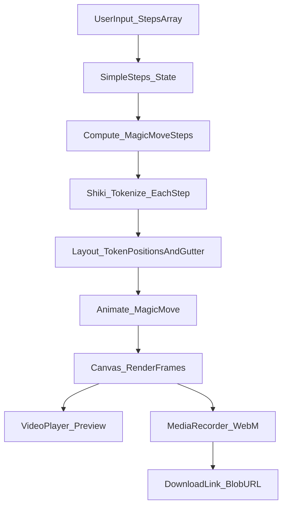

# Code Animation Studio — Usage & Internals (Developer Reference)

This app lets you create animated **WebM** videos of code morphing between steps. Simply paste your code snippets for each step, configure the animation settings, and export a video.

Inspired by Slidev's "Shiki Magic Move" feature.

## Dependencies & APIs (what they do, where we use them)

- **Shiki** (`shiki`)
  - **Responsible for**: **tokenizing code snippets** and providing the **syntax highlighting colors** for each token.
  - **Where**: `app/lib/magicMove/shikiHighlighter.ts`.

- **Canvas 2D API** (Web API)
  - **Responsible for**: **rendering the code frames** and **actually animating the transitions** by drawing tokens at interpolated positions.
  - **Where**: `app/lib/magicMove/canvasRenderer.ts`, `app/lib/magicMove/codeLayout.ts`.

- **MediaStream / `HTMLCanvasElement.captureStream()`** (Web API)
  - **Responsible for**: **capturing the live canvas output** at a given FPS to be processed.
  - **Where**: `app/lib/video/recordCanvas.ts`.

- **MediaRecorder** (Web API)
  - **Responsible for**: **encoding the video stream** into chunks (WebM VP9/VP8).
  - **Where**: `app/lib/video/recordCanvas.ts`.

- **Blob + Object URLs** (Web API)
  - **Responsible for**: **managing recorded video data** and generating the final **video download link**.
  - **Where**: `app/page.tsx`.

- **Bun** (`bun`)
  - **Responsible for**: **development workflow**, dependency management, and running build scripts.
  - **Where**: `package.json` scripts.

## What you can do

- **Edit steps**: Add, remove, and edit code steps directly in textareas
- **Configure settings**: 
  - Choose programming language for syntax highlighting
  - Select theme (color scheme)
  - Toggle line numbers on/off
  - Set starting line number
  - Adjust transition duration (100-5000ms)
  - Set FPS for export (10-60)
- **Preview animation**: 
  - Play/Pause controls to start/stop playback
  - Scrub through timeline using the progress bar
  - Reset button to jump back to the beginning
  - See current time and total duration
- **Export video**: Generate a downloadable `.webm` video file with progress tracking

## How to use

### Creating steps

1. **Add steps**: Click "New Step" to add a new code step
2. **Edit code**: Paste or type your code directly into each step's textarea
3. **Remove steps**: Hover over a step and click the trash icon (minimum 1 step required)
4. **Reorder**: Steps animate in order from top to bottom

### Configuration

All settings are available in the steps panel header:

- **Language**: Select the programming language for syntax highlighting (applies to all steps)
- **Theme**: Choose a color theme (e.g., Vitesse Dark, GitHub Light, Nord)
- **Settings**: Open the settings popover to configure:
  - **Line Numbers**: Toggle line numbers on/off (applies to all steps)
  - **Start Line**: Set the starting line number (when line numbers are enabled)
  - **FPS**: Set frames per second for video export (10-60)

### Line numbers

- Enable/disable line numbers globally via the settings popover
- When enabled, set the starting line number (default: 1)
- All steps use the same line number settings

## Preview vs Export behavior (long code blocks)

- **Preview**: The canvas grows vertically to fit the longest step in the selected block, and the preview container is scrollable.
- **Export**: The canvas height is fixed at the start of recording (based on the longest step) so the video includes **all lines** with no clipping.

## Video Player (Preview)

The preview player allows you to scrub through the animation timeline and see how the code morphs between steps.

### Timeline Structure

The timeline is calculated based on:
- **Start hold**: 250ms pause before the first transition
- **Transitions**: User-configurable duration (default 800ms, range 100-5000ms) for morphing between steps
- **Between holds**: 120ms pause after each transition before the next one
- **End hold**: 250ms pause after the final step

**Formula**: `totalMs = startHold + (transitions × transitionMs) + (transitions × betweenHold) + endHold`

For a single step, the timeline is simply `startHold + endHold` (500ms total).

### Playback Mechanism

- **State**: Uses `playheadMs` to track current position (0 to `timeline.totalMs`)
- **Animation loop**: When playing, uses `requestAnimationFrame` to update `playheadMs` based on elapsed time (`performance.now()` delta)
- **Rendering**: Each frame calls `renderAt(playheadMs)` which:
  1. Calculates which step/transition is active based on the timeline
  2. For transitions, computes animation progress (0-1) and calls `animateLayouts()` to interpolate token positions
  3. Draws the frame using `drawCodeFrame()` with either static or animated tokens
- **Looping**: When `playheadMs` reaches `timeline.totalMs`, it resets to 0 (seamless loop)

### Controls

- **Play/Pause**: Toggles the `requestAnimationFrame` loop
- **Progress bar**: Clickable scrubber that sets `playheadMs` directly (percentage × `timeline.totalMs`)
- **Reset**: Stops playback and sets `playheadMs` to 0
- **Time display**: Shows current position and total duration in milliseconds

### Rendering Logic (`renderAt`)

The `renderAt(ms)` function determines what to render at a given timestamp:

1. **Single step**: Renders the only step statically
2. **Start hold**: Renders the first step statically
3. **Transition**: Calculates progress (0-1) and renders animated tokens using `animateLayouts()`
4. **Between hold**: Renders the destination step statically
5. **End hold**: Renders the final step statically

The canvas height is dynamically calculated based on the maximum line count across all steps (minimum 1080px for Full HD).

## Export (Video Recording)

The export process records the animation as a WebM video file that can be downloaded.

### Export Process

1. **Canvas Setup**:
   - Sets fixed canvas dimensions: width from `makeDefaultLayoutConfig()` (1920px), height calculated from max line count
   - Ensures consistent frame size throughout recording

2. **Render Loop**:
   - Creates a render loop using `requestAnimationFrame` that drives through the entire timeline
   - For each frame, calls `renderAt(elapsed)` where `elapsed` is calculated from `performance.now()` since export started
   - Continues until `elapsed >= durationMs`

3. **Stream Capture**:
   - Uses `canvas.captureStream(fps)` to create a `MediaStream` from the canvas
   - The stream captures frames at the configured FPS (default 30, range 10-60)

4. **MediaRecorder**:
   - Creates a `MediaRecorder` instance with the stream
   - Codec selection (in order of preference):
     - `video/webm;codecs=vp9` (10 Mbps bitrate) - best quality
     - `video/webm;codecs=vp8` (8 Mbps bitrate) - good compatibility
     - `video/webm` (default bitrate) - fallback
   - Uses higher bitrates than browser defaults for better text clarity

5. **Recording**:
   - Starts recording with `recorder.start(250)` (chunk interval: 250ms)
   - Tracks progress via `onProgress` callback (elapsed/total)
   - Stops after `durationMs` with a small buffer to flush final chunks

6. **Blob Creation**:
   - Collects all data chunks from `ondataavailable` events
   - Creates a `Blob` with the appropriate MIME type
   - Generates a download URL via `URL.createObjectURL(blob)`

7. **Cleanup**:
   - Resets playhead to 0
   - Renders frame at 0 to restore preview state
   - Shows download button with the generated URL

### Export Settings

- **FPS**: Configurable (10-60), affects both playback smoothness and file size
- **Transition duration**: Configurable (100-5000ms), affects total video length
- **Canvas resolution**: Fixed width (1920px), dynamic height based on content
- **Bitrate**: Automatically set based on codec (VP9: 10 Mbps, VP8: 8 Mbps)

### Progress Tracking

During export, the UI shows:
- Progress percentage: `(elapsed / total) × 100`
- Button text: "Processing X%" while exporting
- Export button is disabled during recording

## How it works (runtime flow)

## Step-by-step execution flow

For a detailed breakdown of the exact sequence of file/function calls during the app's lifecycle, see **[EXECUTION_FLOW.md](./EXECUTION_FLOW.md)**.

This document covers:
- Initial setup and state initialization
- Data transformation (SimpleStep → MagicMoveStep)
- Tokenization and layout computation
- Timeline calculation
- Frame rendering (static and animated)
- Playback animation loop
- Video export process
- Download workflow

## File-by-file reference (what each file does)

### UI (app)

#### `app/page.tsx`
- **Role**: The whole MVP UI and orchestrator.
- **Owns state**:
  - `simpleSteps`: array of code steps (simple mode)
  - `selectedLang`: language for syntax highlighting
  - `simpleShowLineNumbers`, `simpleStartLine`: line number settings
  - `theme`: Shiki theme choice
  - `fps`, `transitionMs`: export/playback settings
  - `stepLayouts`: computed layouts for each step
  - `isPlaying`, `playheadMs`: playback state
  - `isExporting`, `exportProgress`, `downloadUrl`: export state
- **Key responsibilities**:
  - **Simple mode**: manages steps array, allows adding/removing/editing steps
  - **Tokenize & layout**: computes `stepLayouts` via `shikiTokenizeToLines()` and `layoutTokenLinesToCanvas()` for each step
  - **Timeline calculation**: computes total duration based on holds and transitions
  - **Render function** (`renderAt`): determines which step/transition to render at a given timestamp
  - **Video player**:
    - Uses `requestAnimationFrame` loop when `isPlaying` is true
    - Updates `playheadMs` based on elapsed time (delta from `performance.now()`)
    - Loops back to 0 when reaching `timeline.totalMs`
    - Progress bar allows scrubbing by setting `playheadMs` directly
  - **Export**:
    - Sets fixed canvas dimensions (width: 1920px, height: calculated from max lines)
    - Creates render loop that drives through entire timeline
    - Calls `recordCanvasToWebm()` to capture stream and encode to WebM
    - Tracks progress and creates download URL when complete

### Types and data structures

#### `app/lib/magicMove/types.ts`
- **Role**: shared types used across render/export.
- **Key types**:
  - `SimpleStep`: `{ code: string }` - user input format
  - `MagicMoveStepMeta`: `{ lines: boolean; startLine: number }` - line number settings
  - `MagicMoveStep`: `{ lang: string; code: string; meta: MagicMoveStepMeta }` - processed step format
  - `StepLayout`: `{ layout: LayoutResult; tokenLineCount: number; startLine: number; showLineNumbers: boolean }` - computed layout for a step (defined in `app/page.tsx`)

The app uses a simple mode where users directly input code steps, and these are converted to `MagicMoveStep[]` format via `useMemo` in `app/page.tsx`.

### Highlighting + layout + rendering

#### `app/lib/magicMove/shikiHighlighter.ts`
- **Role**: one-time Shiki initialization + per-step tokenization.
- **Functions**:
  - `shikiTokenizeToLines({code, lang, theme})` → `{ lines, bg }`
- **Themes**: 
  - `github-light`, `github-dark`
  - `nord`
  - `one-dark-pro`
  - `vitesse-dark`, `vitesse-light`
- **Languages loaded**: JavaScript, TypeScript, TSX, JSX, JSON, SQL, CSS, HTML, Markdown, Bash, Shell.
- **Fallback**: if tokenization fails (unknown lang), it re-tokenizes as `text`.

#### `app/lib/magicMove/codeLayout.ts`
- **Role**: compute where each token should be drawn on the canvas.
- **Functions**:
  - `makeDefaultLayoutConfig()` returns default sizes (1920×1080 baseline, font, padding).
  - `calculateCanvasHeight({ lineCount, ... })` computes the canvas height to fit all lines (plus one blank line at bottom).
  - `layoutTokenLinesToCanvas({ ctx, tokenLines, ... })` returns `LayoutResult`:
    - positioned tokens
    - gutter width + colors
- **Notes**:
  - Layout assumes a monospace font and uses `ctx.measureText("M")` for character width.

#### `app/lib/magicMove/canvasRenderer.ts`
- **Role**: draw a single frame (background “card”, gutter, tokens).
- **Functions**:
  - `clearAndPaintBackground(...)`
  - `drawCodeFrame({ ctx, config, layout, tokens? ... })`
- **Important detail**:
  - Uses `ctx.canvas.width/height` (not the config) to avoid clipping when the canvas is dynamically resized.

### Animation

#### `app/lib/magicMove/animate.ts`
- **Role**: compute animated token positions between two layouts.
- **Function**:
  - `animateLayouts({ from, to, progress })` → `AnimatedToken[]`
- **Matching strategy** (MVP):
  - Keyed by `(tokenText, occurrenceIndex)` so repeated tokens are matched in order.
  - Unmatched tokens fade out/in.

### Recording / export

#### `app/lib/video/recordCanvas.ts`
- **Role**: record a canvas into a `.webm` Blob.
- **Function**:
  - `recordCanvasToWebm({ canvas, fps, durationMs, onProgress })` → `Blob`
- **Process**:
  1. Creates `MediaStream` via `canvas.captureStream(fps)`
  2. Selects best supported codec using `pickMimeType()`:
     - `video/webm;codecs=vp9` (10 Mbps) - preferred
     - `video/webm;codecs=vp8` (8 Mbps) - fallback
     - `video/webm` (default bitrate) - last resort
  3. Creates `MediaRecorder` with selected codec and bitrate
  4. Starts recording with 250ms chunk interval
  5. Tracks progress via `onProgress` callback (called on each `requestAnimationFrame` tick)
  6. Stops after `durationMs` with buffer for final chunk flush
  7. Collects chunks and creates final `Blob`
- **Quality strategy**:
  - Uses higher bitrates than browser defaults (10 Mbps for VP9, 8 Mbps for VP8) for better text clarity
  - Codec selection ensures best quality available on the user's browser

## Where "the options" live

- **Video / playback knobs**: `app/page.tsx`
  - `fps`: 10-60 FPS (affects playback smoothness and file size)
  - `transitionMs`: 100-5000ms transition duration (affects total video length)
  - Theme selection: Shiki theme picker (affects colors)
  - Line numbers: toggle and start line number (affects layout)
  - Export button: triggers video recording
- **Timeline timing**: `app/page.tsx` (`timeline` calculation)
  - Start hold: 250ms (fixed)
  - Between hold: 120ms (fixed)
  - End hold: 250ms (fixed)
  - Transition: user-configurable via `transitionMs`
- **Canvas resolution**: `app/lib/magicMove/codeLayout.ts` (`makeDefaultLayoutConfig()` baseline width: 1920px)
- **Dynamic height**: `app/lib/magicMove/codeLayout.ts` (`calculateCanvasHeight()` - minimum 1080px)
- **Bitrate / codec**: `app/lib/video/recordCanvas.ts`
  - VP9: 10 Mbps
  - VP8: 8 Mbps
  - Fallback: browser default
- **Supported languages**: `app/lib/magicMove/shikiHighlighter.ts`

## Notes / limitations (current MVP)

- Export format is **WebM** (MP4 would require ffmpeg, typically server-side).
- "Magic move" matching is a pragmatic heuristic (good for many refactors, not perfect for all diffs).
- All steps use the same language and line number settings (no per-step configuration).
- Canvas height is dynamic based on the longest step (minimum 1080px for Full HD).
- Maximum recommended steps: performance may degrade with very long sequences (50+ steps).

## Troubleshooting

- **Animation not showing**
  - Ensure you have at least one step with code
  - Check that the language selection matches your code (for proper syntax highlighting)
  - Verify the canvas is rendering (check browser console for errors)

- **Video looks blurry**
  - The app records at **1920×(dynamic height)** and uses a higher bitrate, but quality still depends on browser codec support.
  - VP9 usually yields best quality; the recorder falls back to VP8 if needed.
  - Try increasing the FPS setting (higher FPS = smoother but larger file)

- **Export fails or hangs**
  - Ensure you have at least one step
  - Check browser console for errors
  - Try reducing the number of steps or transition duration
  - Some browsers may have limitations on MediaRecorder; try a different browser

- **Line numbers not showing**
  - Enable line numbers in the settings popover
  - Ensure the starting line number is set to 1 or higher

